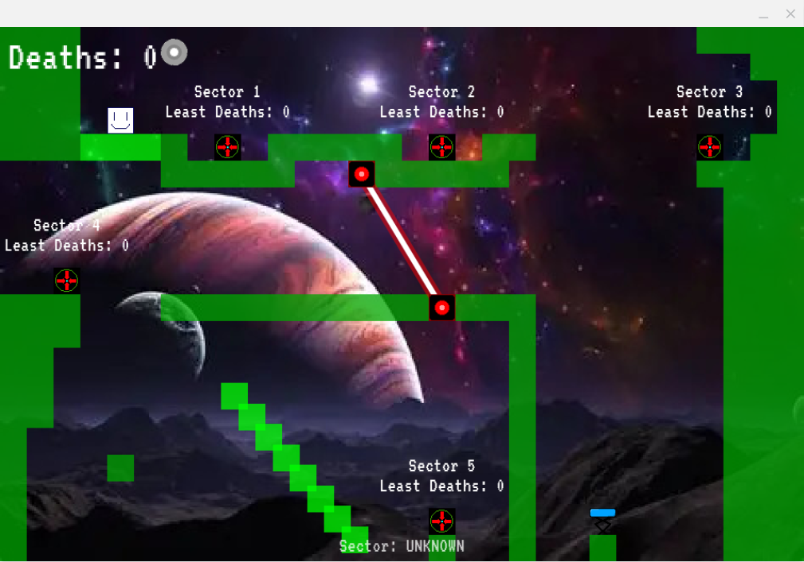
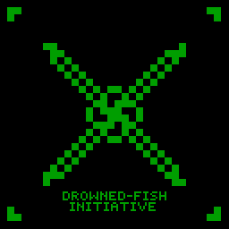

# Drowned-Fish
A simple 2D troll game made with Love2D. The name is a thing as impossible as you beating this game. It has 26 levels, uncountable traps and lots and lots of teasing voicelines meant specifically to annoy `you`.

## Requirements
### To play:
None (except if you want to play the `.love` universal version, which needs Love2D installed). You can download a build on the [GitHub Releases](https://github.com/Br-Zueira/Drowned-Fish/releases) page. It's officially supported for Windows and Linux at x86_64 architectures. For other systems or architectures, you may want to download the `.love` build along with a Love2D runtime, which can be downloaded [at the official Love2D page](https://love2d.org).

### To compile:

#### To Windows
Bash, Zip, Windows standalone Love2D 64 bits

#### To Linux
Bash, Zip, Appimagetool, Love2D x86_64 official Appimage

#### Bundle only (universal love format)
Bash, Zip

## Credits & Acknowledgements
### Special Thanks
* **Love2D and Lua** -> Made this game possible
* **Tiled** -> Made building levels not be an absolute pain
* **Zip, YT-DLP, FFMPEG, AppImageTools** -> Tools that helped out during development
* **The whole supplain chain that led us here** -> Everyone and every tool that led to invention of games, internet and x86_64 PCs

### Libraries
* **STI** -> Made implementing Tiled practical and easy
* **Json.lua** -> Made implementing save system very convenient
* **Bump.lua** -> Made physics not be an absolute pain (most of the time, though)

### Assets
* **Imphenzia** -> Made the amazing, non copyright songs
* **Pixil** -> Made me able of doing non awful dev arts
* **Br-Zueira (Myself)** -> The narrator that annoyed (or will annoy) you the whole game
* **Google Fonts** -> Font (duh)
* **PixaBay** -> SFX

### Inspirations
* **Level Devil** is the biggest one
* **GLaDOS (Portal)** for narrator
* **Maybe** a bit of There's No Game and Stanley Parable to
* **Space and Matrix** for design

## This is a document made by the Drowned-Fish initiative
